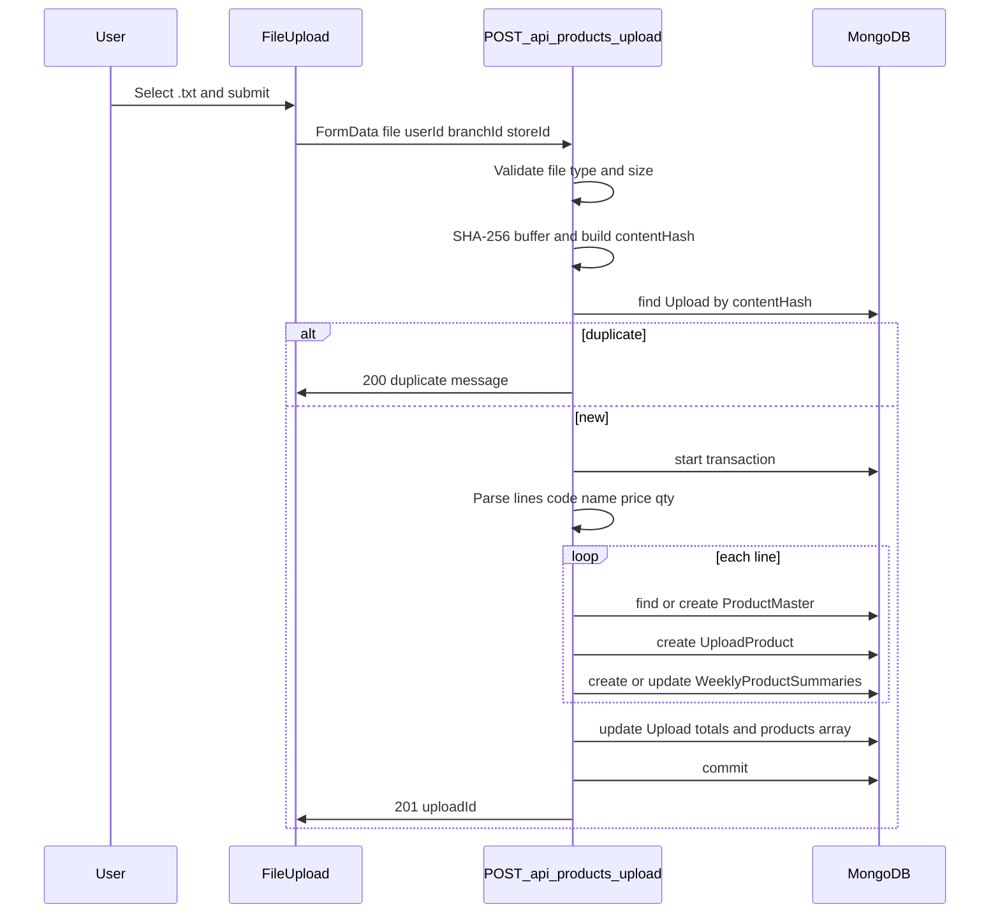

# Stock Flow — Codebase Documentation

This document describes the **Stock Flow** application (npm package name: **`product-analysis`**). It is aimed at developers who are new to the repository.

---

## Section 1 — Project overview

### What the application does

Stock Flow is an inventory and stock-analysis web app. Users belong to a **store** (and optionally a **branch**). They upload **plain-text (.txt)** stock files containing product lines; the backend normalizes data into **ProductMaster** catalog rows, **Upload** / **UploadProduct** records, and **WeeklyProductSummaries** for reporting. The UI includes dashboards, branch and product analytics charts, user and branch management, and Excel exports of weekly summaries.

### Tech stack

| Area | Technology |
|------|------------|
| Framework | **Next.js 15.3.1** (App Router under `app/`) |
| UI | **React 19**, **TypeScript** |
| Styling | **Tailwind CSS 4** |
| Database | **MongoDB** via **Mongoose 8** |
| Auth | **NextAuth v5** (`next-auth@5.0.0-beta.27`) — Credentials, GitHub, Google |
| Validation | **Zod**, **react-hook-form**, **@hookform/resolvers** |
| Tables / charts | **TanStack Table**, **TanStack Query**, **Recharts** |
| Excel | **Exceljs** |
| Password hashing | **bcrypt** / **bcryptjs** |
| Queues (wired, lightly used) | **BullMQ**, **ioredis**; **@upstash/redis** also in dependencies |
| Logging | **pino**, **pino-pretty** |
| Dev | `next dev --turbopack` |

Other notable libraries: **Radix UI** primitives, **Tabler** / **Lucide** icons, **date-fns**, **slugify**, **sonner**, **next-themes**.

### How the app is structured

- **`app/(admin)/`** — Logged-in style shell (sidebar, header) and main feature **pages**. Route URLs are the path inside the group (for example `/dashboard`, `/uploads`), not `/admin/...`.
- **`app/(auth)/`** — **Sign-in** and **sign-up** pages.
- **`app/api/**`** — Next.js **Route Handlers** (REST-style JSON or file responses).
- **`app/page.tsx`** — Public landing (“Stock ~ Flow”).
- **`database/`** — Mongoose models (`*.model.ts`).
- **`lib/`** — DB connection (`mongoose.ts`), **validations**, **server actions**, **API fetch helpers**, **job queue** definitions, error helpers.
- **`components/`** — Shared UI (shadcn-style), forms, charts, tables, navigation.
- **`middleware.ts`** — Re-exports NextAuth’s `auth` as middleware (see Section 5).

Environment: MongoDB URI and NextAuth secrets are expected via standard Next.js / NextAuth environment variables (see `auth.ts` and `lib/mongoose.ts` usage in the codebase).

---

## Section 2 — Database schemas

Each subsection is one model file under `database/`. Types are Mongoose schema types unless noted. All listed models use **`timestamps: true`** (adds `createdAt` and `updatedAt`) except where the schema snippet shows otherwise.

### User (`database/user.model.ts`)

**Model name:** `User`

| Field | Type | Required | Meaning |
|-------|------|----------|---------|
| `name` | String | Yes | Given name |
| `surname` | String | Yes | Family name |
| `email` | String | Yes | Login identity; **unique** index |
| `image` | String | No | Profile image URL |
| `storeId` | ObjectId → `Store` | No | Store the user belongs to |
| `branchId` | ObjectId → `Branch` | No | Branch assignment (used heavily for uploads) |

**Relations:** Optional links to **Store** and **Branch**. There is **no** `roleId` or embedded role on this schema.

### Account (`database/account.model.ts`)

**Model name:** `Account`

| Field | Type | Required | Meaning |
|-------|------|----------|---------|
| `userId` | ObjectId → `User` | Yes | Owning user |
| `name` | String | Yes | Display name on the auth account |
| `image` | String | No | Avatar URL |
| `password` | String | No | Hashed password (credentials provider) |
| `provider` | String | No* | Auth provider key (e.g. `credentials`, `github`) |
| `providerAccountId` | String | No* | Provider’s account id (for credentials, typically **email**) |

\*Not marked `required` in schema but used as such in application logic.

**Relations:** Belongs to **User**. Uniqueness for “same OAuth account twice” is enforced in API logic (`provider` + `providerAccountId`), not necessarily as a compound DB index in the schema file.

### Role (`database/role.model.ts`)

**Model name:** `Role`

| Field | Type | Required | Meaning |
|-------|------|----------|---------|
| `name` | String | Yes | Role label (e.g. could be “Admin”) |

**Relations:** **None** in schema. The **User** model does **not** reference **Role**. The **Role** collection is exported from `database/index.ts` but is **not** wired into authentication or authorization in this codebase.

### Store (`database/store.model.ts`)

**Model name:** `Store`

| Field | Type | Required | Meaning |
|-------|------|----------|---------|
| `name` | String | Yes | Store name |
| `userId` | ObjectId → `User` | Yes | Owner user (who created the store on sign-up) |

**Relations:** One store is tied to one **owner** user; **branches** reference this store.

### Branch (`database/branch.model.ts`)

**Model name:** `Branch`

| Field | Type | Required | Meaning |
|-------|------|----------|---------|
| `name` | String | Yes | Branch name |
| `storeId` | ObjectId → `Store` | Yes | Parent store |
| `location` | String | Yes | Location label (used in analytics grouping) |

**Relations:** Belongs to **Store**. **Users** and **uploads** reference branches.

### ProductMaster (`database/productmaster.model.ts`)

**Model name:** `ProductMaster`

| Field | Type | Required | Meaning |
|-------|------|----------|---------|
| `name` | String | Yes | Canonical product name |
| `standardCode` | String | Yes | Product code / SKU (used as the primary match key on upload) |
| `aliases` | String[] | No (default `[]`) | Alternate names seen in files |

**Relations:** Referenced by **UploadProduct** and **WeeklyProductSummaries** (as `productId` in summaries). **No explicit foreign key** beyond Mongoose `ref` on consumers.

### Upload (`database/upload.model.ts`)

**Model name:** `Upload`

| Field | Type | Required | Meaning |
|-------|------|----------|---------|
| `uploadedBy` | ObjectId → `User` | Yes | Who performed the upload |
| `storeId` | ObjectId → `Store` | Yes | Store scope |
| `branchId` | ObjectId → `Branch` | Yes | Branch scope |
| `upload_date` | Date | Yes | Logical upload date used for week/month/year |
| `week` | Number | Yes | Week number (custom helper, not ISO week from `date-fns` in all places) |
| `month` | String | Yes | English month name |
| `year` | Number | Yes | Calendar year |
| `fileName` | String | Yes | Generated server-side file name |
| `contentHash` | String | Yes | Deduplication key; **unique** index |
| `products` | ObjectId[] → `UploadProduct` | Per schema | Intended to list **UploadProduct** documents (see Section 7 for implementation mismatch) |
| `totalProducts` | Number | Yes | Aggregated quantity total |
| `estimatedValue` | Decimal128 | Yes | Total stock value estimate |

**Relations:** **User**, **Store**, **Branch**, and (intended) **UploadProduct** children.

### UploadProduct (`database/uploadproduct.model.ts`)

**Model name:** `UploadProduct`

| Field | Type | Required | Meaning |
|-------|------|----------|---------|
| `uploadId` | ObjectId → `Upload` | Yes | Parent upload batch |
| `storeId` | ObjectId → `Store` | Yes | Store |
| `branchId` | ObjectId → `Branch` | Yes | Branch |
| `productId` | ObjectId → **`Product`** (schema) | Yes | In practice stores **ProductMaster** `_id` (there is no `Product` model — see Section 7) |
| `name` | String | Yes | Name as it appeared in the file |
| `code` | String | Yes | Code from the file (matches ProductMaster `standardCode` when consistent) |
| `qty` | Number | Yes | Quantity on hand for this snapshot |
| `price` | Decimal128 | Yes | Unit price |
| `upload_date` | Date | Yes | Same logical date as parent upload |
| `week` | Number | Yes | Week number |
| `month` | String | Yes | Month name |
| `year` | Number | Yes | Year |

**Relations:** **Upload**, **Store**, **Branch**, and catalog row (intended as ProductMaster).

### WeeklyProductSummaries (`database/weekly_product_summaries.model.ts`)

**Model name:** `WeeklyProductSummaries`

| Field | Type | Required | Meaning |
|-------|------|----------|---------|
| `storeId` | ObjectId → `Store` | Yes | Store |
| `branchId` | ObjectId → `Branch` | Yes | Branch |
| `productId` | ObjectId → `ProductMaster` | Yes | Product |
| `code` | String | Yes | Product code snapshot |
| `week` | Number | Yes | Week index used in reporting |
| `year` | Number | Yes | Year |
| `upload_date` | Date | Yes | Associated upload date |
| `startQuantity` | Number | Yes | Opening qty for the period logic |
| `endQuantity` | Number | No (nullable) | Closing qty when known |
| `price` | Decimal128 | Yes | Price used in calculations |
| `estimatedSales` | Decimal128 | No (default `0.00`) | Estimated sales value |
| `restocked` | Boolean | Yes | Whether restock was inferred |
| `restockAmount` | Number | Yes | Restock amount when applicable |

**Relations:** **Store**, **Branch**, **ProductMaster**.

### Indexes and constraints (summary)

- **User:** `email` — **unique**.
- **Upload:** `contentHash` — **unique** (duplicate uploads with the same hash are rejected).
- Other compound uniqueness (e.g. one summary per product/week/year/branch) is **not** declared as unique indexes in these files; some logic uses `updateOne` with filters and `upsert`.

---

## Section 3 — API routes and `app/api` files

Below, **auth** means `auth()` from NextAuth is used. Many **user** and **account** routes have **no** session check unless stated.

### Route handlers

#### `/api/auth/[...nextauth]` — `app/api/auth/[...nextauth]/route.ts`

| Method | Purpose |
|--------|---------|
| **GET**, **POST** | NextAuth catch-all: OAuth callbacks, session CSRF, etc. |

**Auth:** Handled by NextAuth.  
**Returns:** NextAuth responses (redirects, JSON, etc.).

---

#### `/api/auth/signin-with-oauth` — `app/api/auth/signin-with-oauth/route.ts`

| Method | Purpose |
|--------|---------|
| **POST** | Creates or updates **User** and **Account** after OAuth providers approve sign-in. |

**Body (JSON):** `provider`, `providerAccountId`, `user` — validated with `SignWithOauthSchema` (`lib/validations.ts`).  
**Success:** `{ success: true }`.  
**Error:** JSON via `handleError` (validation, transaction abort).  
**Auth:** Intended to be called from NextAuth’s `signIn` callback (server-side), not as a public anonymous API for arbitrary sign-ups without provider proof (rely on NextAuth flow).

---

#### `/api/users` — `app/api/users/route.ts`

| Method | Purpose |
|--------|---------|
| **GET** | Lists **all** users in the database. |
| **POST** | Creates a user from JSON body validated with `UserSchema`. Rejects duplicate `email`. |

**Auth:** None.  
**Success:** `{ success: true, data: users | newUser }` with appropriate status (200 / 201).  
**Error:** `handleError` output.

---

#### `/api/users/[id]` — `app/api/users/[id]/route.ts`

| Method | Purpose |
|--------|---------|
| **GET** | Fetch user by Mongo `_id`. |
| **PUT** | Partial update with `UserSchema.partial()`. |
| **DELETE** | Delete user by `_id`. |

**Auth:** None.  
**Params:** Dynamic segment `id`.  
**Errors:** `NotFoundError` if missing; otherwise `handleError`.

---

#### `/api/users/email` — `app/api/users/email/route.ts`

| Method | Purpose |
|--------|---------|
| **POST** | Look up user by `email` in JSON body (`UserSchema.partial()` for email). |

**Auth:** None.  
**Success:** `{ success: true, data: user }`.  
**Note:** `lib/api.ts` defines `getByEmail` against URL pattern `users/email/${email}`; the actual route file is **`/api/users/email`** with a **POST body**, not a path parameter. That client helper may not match this route without adjustment (see Section 7).

---

#### `/api/users/all` — `app/api/users/all/route.ts`

| Method | Purpose |
|--------|---------|
| **GET** | Returns users in the **same store** as the session user, excluding the current user, with `branchId` populated (`name`, `location`). |

**Auth:** Yes — `auth()`; returns **404** with `{ success: false }` if no session or no `storeId` on user (not 401).  
**Implementation:** Uses `getUser` then `getUsers` server actions.

---

#### `/api/accounts` — `app/api/accounts/route.ts`

| Method | Purpose |
|--------|---------|
| **GET** | Lists all accounts. |
| **POST** | Creates account; `AccountSchema.parse(body)`; rejects duplicate `provider` + `providerAccountId`. |

**Auth:** None.  
**Errors:** `ForbiddenError` if provider account exists.

---

#### `/api/accounts/[id]` — `app/api/accounts/[id]/route.ts`

**Important:** This file is a **copy of the users `[id]` route** — it imports **`User`** and **`UserSchema`** and performs user CRUD. It does **not** operate on the **Account** model by id. Treat as **bug** (Section 7).

---

#### `/api/accounts/provider` — `app/api/accounts/provider/route.ts`

| Method | Purpose |
|--------|---------|
| **POST** | Body is parsed as JSON (typically the **email string** or provider id). Looks up **`Account`** with `findOne({ providerAccountId: providerEmail })`. |

**Auth:** None (used internally from `auth.ts` / `lib/api.ts`).  
**Validation:** `AccountSchema.partial({ providerEmail })` — field naming does not match schema fields exactly; behavior depends on Zod partial shape.  
**Success:** `{ success: true, data: account }`.

---

#### `/api/branches` — `app/api/branches/route.ts`

| Method | Purpose |
|--------|---------|
| **GET** | Branches for the logged-in user’s `storeId` via `getBranchesByStore`. |

**Auth:** `auth()`; **404** `{ success: false }` if unauthenticated or user has no `storeId`.  
**Success:** `{ success: true, data: { branches } }` from action (shape matches `getBranchesByStore`).

---

#### `/api/upload` — `app/api/upload/route.ts`

| Method | Purpose |
|--------|---------|
| **POST** | **Legacy / alternate pipeline:** reads a CSV-like text file (sorted by first column as name), merges into `public/products.txt`, rebuilds `public/products.xlsx` with ExcelJS. Returns `{ downloadUrl: "/products.xlsx" }`. |
| **GET** | Lists **Upload** documents for `?storeId=` with `branchId` populated (`name`, `location`); formats dates and numeric fields for the UI. |

**POST body:** `multipart/form-data` with `file`.  
**GET query:** `storeId` required; **404** if missing.  
**Auth:** **None** on GET (store id is caller-supplied).

---

#### `/api/products/upload` — `app/api/products/upload/route.ts`

| Method | Purpose |
|--------|---------|
| **POST** | **Primary Stock Flow upload:** validates `.txt` file, dedupes by `contentHash`, parses lines, writes **Upload**, **UploadProduct**, **ProductMaster**, **WeeklyProductSummaries** inside a transaction. |

**Body:** `multipart/form-data` — `file` (required, `text/plain`, max 100MB per `uploadProductsSchema`), `userId`, `branchId`, `storeId` (strings).  
**Success:** **201** `{ success: true, uploadId }`.  
**Duplicate:** **200** `{ message: "Duplicate upload. No changes made." }`.  
**Error:** **400** invalid file; otherwise `handleError` after transaction abort.  
**Auth:** None — trust `userId` from form (see Section 7).

---

#### `/api/products/export` — `app/api/products/export/route.ts`

| Method | Purpose |
|--------|---------|
| **GET** | Excel workbook of weekly summaries for **store** across `startDate`, `endDate`, `storeId` query params. |

**Response:** Binary `.xlsx` with headers.  
**Auth:** None.

---

#### `/api/products/export/branch` — `app/api/products/export/branch/route.ts`

| Method | Purpose |
|--------|---------|
| **GET** | Same as store export but scoped by `branchId` (+ dates). |

**Auth:** None.

---

#### `/api/products/export/product` — `app/api/products/export/product/route.ts`

| Method | Purpose |
|--------|---------|
| **GET** | Store-level export filtered by `productId` (+ dates, `storeId`). |

**Auth:** None.

---

#### `/api/products/export/product/branch` — `app/api/products/export/product/branch/route.ts`

| Method | Purpose |
|--------|---------|
| **GET** | Branch-level export filtered by `productId` (+ dates, `branchId`). |

**Auth:** None.

---

#### `/api/analytics` — `app/api/analytics/route.ts`

| Method | Purpose |
|--------|---------|
| **GET** | Aggregate dashboard stats for the session user’s **store**: latest upload totals per branch, weekly summary sales, branch count. |

**Auth:** `auth()` + `getUser`; **404** `{ success: false }` if missing session or `storeId`.  
**Success:** `{ success: true, data: combined }` with numeric fields.

---

#### `/api/analytics/branches` — `app/api/analytics/branches/route.ts`

| Method | Purpose |
|--------|---------|
| **GET** | Chart series: estimated sales by week/year/branch location for `?storeId=`, last year of `upload_date`. |

**Query:** `storeId` required.  
**Auth:** None.

---

#### `/api/analytics/products` — `app/api/analytics/products/route.ts`

| Method | Purpose |
|--------|---------|
| **GET** | Same pattern as branches but filtered by `?productId=` as well. |

**Auth:** None.

---

### Non-route file under `app/api`

#### `app/api/products/downloadexcel.ts`

Not a Route Handler. Exports **client-side** helpers `downloadExportAll`, `downloadExportBranch`, `downloadExportProductAll`, `downloadExportProductBranch` that `fetch` the export APIs and trigger browser downloads. Used by admin pages (uploads, download centre, product movement, etc.).

---

### Duplicate / unused route file

#### `app/api/products/upload/route copy.ts`

Duplicate of the upload route in progress; contains **TODO** at line 123. Not served as a separate URL by Next.js (folder name includes a space and “copy” — not a valid parallel route). Safe to ignore at runtime; should be deleted or merged in a cleanup.

---

## Section 4 — Frontend pages

URLs are relative to the site root. The **`(admin)`** and **`(auth)`** groups do not appear in the URL.

### Auth pages (`app/(auth)/`)

| URL | File | What it shows / does | API / actions |
|-----|------|----------------------|---------------|
| `/sign-in` | `app/(auth)/sign-in/page.tsx` | Credentials (and form wired for OAuth via shared form component patterns) | `AuthForm` + `signInWithCredentials` server action |
| `/sign-up` | `app/(auth)/sign-up/page.tsx` | Registration: either new **store** owner (`store` name) or join with `branchId` / `storeId` | `AuthForm` + `signUpWithCredentials` |

**Layout:** `app/(auth)/layout.tsx` wraps auth pages.

---

### Admin pages (`app/(admin)/`)

**Layout:** `app/(auth)/layout.tsx` is not used here; `app/(admin)/layout.tsx` provides **SidebarProvider**, **AppSidebar**, **SiteHeader**. **Session redirect to sign-in is commented out**, so pages may render without a logged-in user unless each page checks.

| URL | File | Purpose | APIs / actions / notes |
|-----|------|---------|-------------------------|
| `/dashboard` | `dashboard/page.tsx` | Client dashboard: stats cards, branch sales chart, interactive chart | `GET /api/branches`, `GET /api/analytics/branches?storeId=...`, `GET /api/analytics` |
| `/dashboard-2` | `dashboard-2/page.tsx` | Demo dashboard using static data from `app/data.tsx` | No live API |
| `/uploads` | `uploads/page.tsx` | Upload history table, date filters, export | `GET /api/branches`, `GET /api/upload?storeId=...`, `downloadexcel` helpers |
| `/uploads/upload` | `uploads/upload/page.tsx` | File upload UI | `auth()`, `getUser`; **requires** `user.branchId` and `user.storeId`; **POST** via `api.products.upload` → `/api/products/upload` |
| `/uploads/view` | `uploads/view/page.tsx` | “Upload details” mockup: static cards, sample table, filters | Mostly placeholder; no real upload id wiring |
| `/branch-up-reports` | `branch-up-reports/page.tsx` | Similar to uploads listing + exports | `GET /api/branches`, `GET /api/upload?storeId=...`, exports |
| `/branches` | `branches/page.tsx` | Branch list + add branch dialog | `GET /api/branches`, `addBranch` server action |
| `/users` | `users/page.tsx` | User table + invite / sign-up dialog | `GET /api/branches`, `GET /api/users/all`, `signUpWithCredentials` |
| `/download-centre` | `download-centre/page.tsx` | Date range + branch filter; download Excel | `GET /api/branches`, export helpers |
| `/branch-analytics` | `branch-analytics/page.tsx` | Branch chart + export | `GET /api/branches`, `GET /api/analytics/branches?storeId=...`, exports |
| `/product-movement` | `product-movement/page.tsx` | Product-specific chart (`productId` query), branch filter, exports | `GET /api/branches`, `GET /api/analytics/products?storeId=&productId=` — **effect dependency** uses `searchParams` but `storeId` may still be empty on first run (race) |
| `/settings` | `settings/page.tsx` | Placeholder text | None |
| `/archived-reports` | `archived-reports/page.tsx` | Placeholder (“Insights page”) | None |

**Navigation:** `constants/constants.ts` (`mainSidebarLinks`, etc.) defines sidebar URLs (e.g. StockFlow. branding in `LeftSidebar.tsx`).

---

## Section 5 — Authentication and roles

### How authentication works

1. **NextAuth** is configured in `auth.ts` with **GitHub**, **Google**, and **Credentials** providers.
2. **Session strategy:** JWT-based flow (`callbacks.jwt` / `callbacks.session`). The **JWT callback** resolves the internal **`token.sub`** to the MongoDB **user `_id`** by calling the accounts API (`api.accounts.getByProvider`) with either the **email** (credentials) or **providerAccountId** (OAuth).
3. **Session callback** copies `token.sub` to **`session.user.id`** for use in server components and API routes.
4. **Credentials `authorize`:** Validates with `SignInSchema`, loads **Account** (via API) and **User**, compares password with **bcrypt.compare**.
5. **OAuth `signIn` callback:** Calls **`POST /api/auth/signin-with-oauth`** to upsert **User** + **Account** in a transaction.
6. **Middleware:** `middleware.ts` exports `auth` from `@/auth` as the middleware function (NextAuth v5 pattern). Fine-grained route protection is inconsistent (admin layout redirect disabled).

**Server actions** (`lib/actions/auth.action.ts`): `signUpWithCredentials` creates User + Account (+ Store for owners), then `signIn("credentials", { redirect: false })`. `signInWithCredentials` validates password and calls `signIn`.

**Protected action helper:** `lib/handlers/action.ts` — when `authorize: true`, loads session via `auth()` and returns `UnauthorisedError` if missing.

### User roles

- **Mongoose `Role` model** exists but is **not** attached to users.
- **`constants/filter.ts`** exports a **`Role`** array (`Admin`, `Clerk`) for **UI filter options only**.
- **No role checks** were found on API routes (e.g. `/api/users` GET remains open).

### Branch and store association

- On **sign-up with a new store**, `User` is created, then **Store** with `userId`, then **User** is updated with **`storeId`** (`lib/actions/auth.action.ts`).
- On **sign-up with** `branchId` and `storeId`, those are stored on **User**.
- **Admin-created users** (`addUser` in `lib/actions/user.action.ts`) set `branchId`, `storeId` on the new user.
- **`/uploads/upload`** requires **`user.branchId`** and **`user.storeId`**; otherwise redirects to sign-in.

---

## Section 6 — The upload flow

### End-to-end journey (primary path: `/api/products/upload`)

1. **User selects a file** on `FileUpload` (`components/FileUpload.tsx`). The form only accepts **`.txt`**; validation also enforces **`text/plain`** and **100MB** max (`uploadProductsSchema` in `lib/validations.ts`).
2. **Client** sends **`FormData`**: `file`, `userId`, `branchId`, `storeId` to **`POST /api/products/upload`** via `lib/api.ts` → `fetchHandler` (no `Content-Type` override for FormData).
3. **Server** starts a **Mongoose session** and transaction.
4. **Content hash:** Raw file bytes are hashed with **`crypto.subtle.digest("SHA-256", ...)`** (`generateSHA256Hash` in `app/api/products/upload/route.ts`, lines 338–343). The stored **`contentHash`** is **`${sha256}_${userId}_${storeId}_${branchId}_${date}`** where **`date`** is the ISO date part of **`upload_date`**. **`upload_date` is set to “today + 14 days”** in code (lines 56–60), which strongly affects deduplication and week/year fields — treat as business logic quirk or bug.
5. **Duplicate check:** If an **Upload** with that **`contentHash`** exists, the handler returns **200** with a duplicate message and **does not** write data (lines 61–66).
6. **Parsing:** File is decoded as UTF-8 text, split into non-empty lines, **sorted by the first CSV field** (treated as name). Each line: **`code,name,price,qty`** (trimmed). Invalid rows are skipped (lines 129–140).
7. **ProductMaster:** Lookup by **`standardCode: code`**. If missing, create with `name` and empty `aliases`. If name is not in `aliases`, **`$addToSet`** on aliases (lines 142–158).
8. **UploadProduct:** One document per line with upload, store, branch, product, quantities, price, and calendar fields (lines 164–180).
9. **WeeklyProductSummaries:**
   - Find **previous** `UploadProduct` for same **product**, **store**, **branch** with **`upload_date` &lt; current** (comment notes `createdAt` would be preferable) (lines 186–193).
   - If **no previous:** create a summary for current week with **`startQuantity: qty`**, **`endQuantity: null`**, zero estimated sales (lines 197–216).
   - If **previous:** compute sales as **`(prevQty - qty) * price`**, set **`restocked`** if negative, **`updateOne`** on summary for **previous upload’s week/year** with **`endQuantity`**, **`estimatedSales`**, etc., then optionally **create** current-week summary if missing (lines 217–271).
10. **Upload record:** Update **`totalProducts`** (sum of quantities) and **`estimatedValue`**, and set **`products`** array (see Section 7 for type mismatch) (lines 276–291).
11. **Commit** transaction. **`processUploadJob`** from the BullMQ processor is **commented out** (lines 299–301).

### Content hash and duplicates

- Deduplication is **not** “same file bytes only.” It includes **user, store, branch**, and the **date string** derived from **`upload_date`** (which is offset by +14 days in code).
- The DB enforces **unique `contentHash`** on **Upload**.

### Matching uploads to ProductMaster

- Match key is **`standardCode` === first column (`code`)** from each line.
- **Display name** from the file is kept on **UploadProduct** and may be added to **ProductMaster.aliases** if it differs from existing alias list.

### Weekly summaries creation/update

- Handled **inline** in `POST /api/products/upload` as described above.
- **`lib/jobs/processors/upload.processor.ts`** is **not** invoked from the route (call commented). If enabled in the future, it would need to align with the schema (today’s processor builds partial summary documents and omits required fields such as **`storeId`**, **`branchId`**, **`upload_date`**). It also references an **`Upload` type** without importing it (TypeScript issue).

### Legacy upload path (`POST /api/upload`)

- Expects CSV-like lines sorted by **product name**; merges into **`public/products.txt`** and updates **`public/products.xlsx`**. Does **not** populate **Upload** / **WeeklyProductSummaries** in Mongo. Separate from the main analytics pipeline.

### Gaps in the flow (brief)

- No authentication on **`POST /api/products/upload`**; **`userId`** is client-supplied.
- **`Upload.products`** stores **wrong id type** (Section 7).
- **Queue** and **`upload.processor.ts`** are unfinished relative to the live implementation.
- **`getISOWeek`** is imported in `route.ts` but **custom `getWeekNumber`** is used instead — possible inconsistency with other date logic.

---

## Section 7 — Known issues and gaps

| Issue | Location |
|-------|----------|
| **`/api/accounts/[id]`** implements **User** CRUD, not Account | `app/api/accounts/[id]/route.ts` (imports `User`, `UserSchema` throughout) |
| **UploadProduct.productId** refs **`Product`** but model is **ProductMaster** | `database/uploadproduct.model.ts` line 29 |
| **`Upload.products`** populated with **ProductMaster `_id`s**, not **UploadProduct** ids | `app/api/products/upload/route.ts` lines 125–126, 287–291 |
| **TODO** placeholder upload implementation | `app/api/products/upload/route copy.ts` line 123 |
| **Unauthorized** responses use **404** + `{ success: false }` instead of **401** | e.g. `app/api/branches/route.ts` lines 10–12; `app/api/analytics/route.ts` lines 12–14 |
| **`getBranchesByStore`** throws if **no branches** | `lib/actions/branch.action.ts` lines 79–81 — breaks `/api/branches` for empty stores |
| **Admin layout** session guard **commented out** | `app/(admin)/layout.tsx` line 11 |
| **`lib/api.ts` `analytics.branch`** calls **`/products/export?storeId=`** | `lib/api.ts` lines 64–68 — wrong handler for branch analytics data |
| **`getByEmail` URL** may not match **`POST /api/users/email`** | `lib/api.ts` line 29 vs `app/api/users/email/route.ts` |
| **Duplicate / backup files** | `app/api/products/upload/route copy.ts`, `components/FileUpload copy.tsx` |
| **Extensive `console.log`** in auth and APIs | e.g. `auth.ts`, multiple route files |
| **`accounts/provider` POST** validates `providerEmail` against **AccountSchema.partial** shape that may not match body | `app/api/accounts/provider/route.ts` lines 23–25 |
| **Product movement page:** chart fetch may run **before `storeId`** is set | `app/(admin)/product-movement/page.tsx` — `useEffect` depends on `searchParams` but not `storeId` |

---

## Section 8 — What is working vs partially implemented

### Fully functional (with caveats)

- **Sign-up / sign-in** (credentials) and **OAuth** flow via NextAuth + `/api/auth/signin-with-oauth`, assuming environment and provider apps are configured.
- **Branch listing** for users with a valid **`storeId`**, when at least one branch exists.
- **Stock TXT upload** through **`POST /api/products/upload`** writing **ProductMaster**, **Upload**, **UploadProduct**, and **WeeklyProductSummaries** in one transaction.
- **Dashboard aggregates** (`/api/analytics`) when session and data exist.
- **Branch/product chart APIs** when `storeId` (and `productId` where needed) are provided.
- **Excel exports** for date ranges and store/branch/product filters, when query params are valid.

### Partially implemented

- **Authorization:** Session exists, but many routes and the admin shell do not enforce it consistently; **roles** are not enforced.
- **Upload → Upload.products:** Schema and code disagree; **populate** of line items from **Upload** will not work as written.
- **Background jobs:** Queue and processor exist but are **not** used by the main upload route; processor logic does not match schema requirements.
- **Analytics UX:** Some client pages assume **`data.branches[0]`** exists and may throw or fail silently; product chart **`storeId`** timing issue.
- **`/api/upload` GET** exposes listing by **storeId** without auth.

### Stub or placeholder

- **`/settings`**, **`/archived-reports`** — minimal placeholder UI.
- **`/uploads/view`** — hard-coded cards and labels.
- **`/dashboard-2`** — demo/static data.
- **Landing `app/page.tsx`** — marketing shell; session only changes button label.
- **Sidebar footer user** (`NavUser`) commented out in `LeftSidebar.tsx`.

---

*Document generated from repository state. Line numbers refer to the codebase at documentation time and may shift with edits.*
